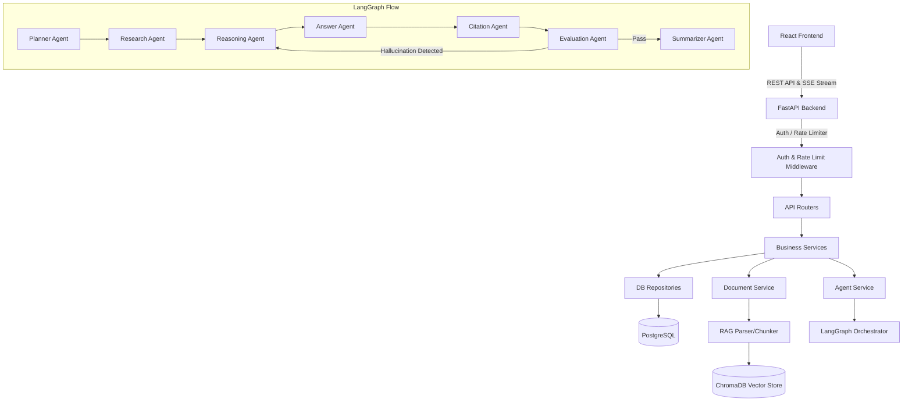
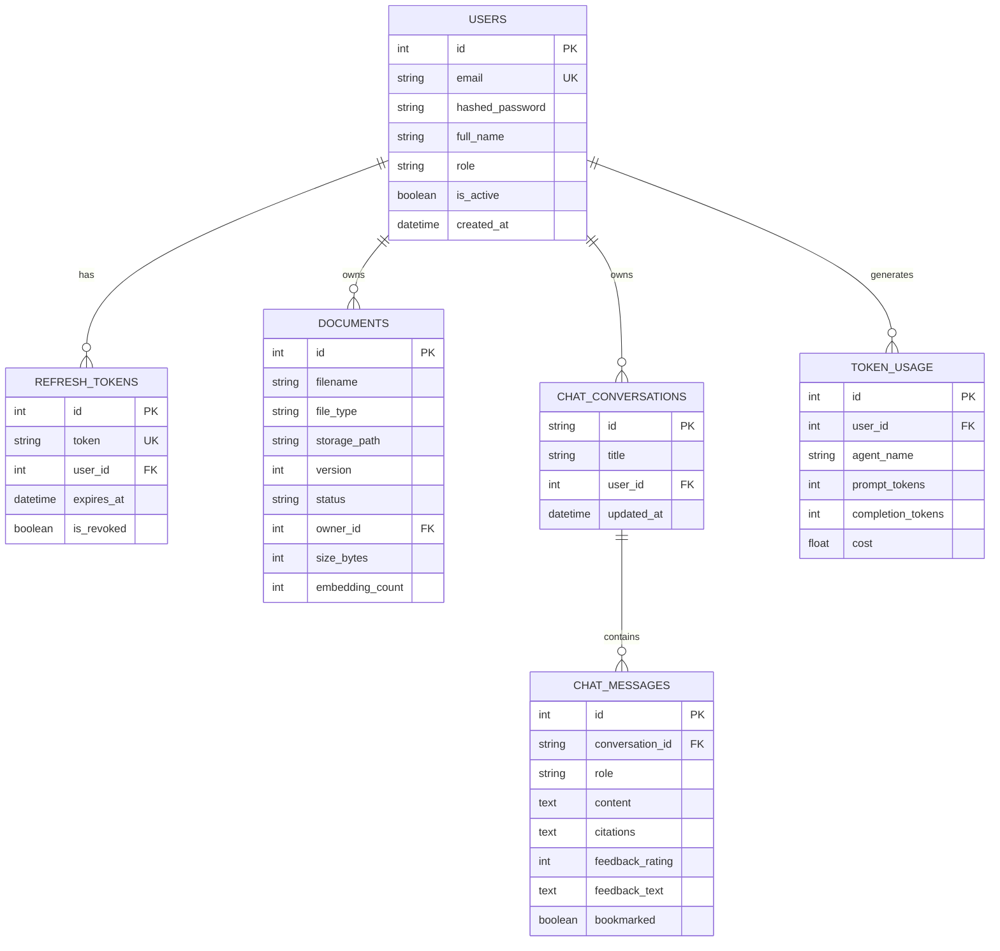

# Enterprise Knowledge Intelligence Platform

A production-grade, scalable, Multi-Agent Enterprise Knowledge Intelligence Platform combining a React + TypeScript frontend, a FastAPI backend, PostgreSQL for structured storage, and ChromaDB for vector embeddings. The RAG pipeline is orchestrated using a 7-agent network coordinated through **LangGraph** and **LangChain**.

---

## Technical Architecture



### Multi-Agent Network (LangGraph)
The platform uses seven specialized agents working together:
1. **Planner Agent**: Analyzes the question and defines step-by-step query splits and reasoning tasks.
2. **Research Agent**: Uses semantic and keyword queries on ChromaDB to retrieve facts.
3. **Reasoning Agent**: Synthesizes the facts, analyzing context validity and consistency.
4. **Answer Agent**: Formulates a detailed, Markdown-formatted answer based on synthesized reasoning.
5. **Citation Agent**: Maps statements in the answer back to exact document chunks.
6. **Evaluation Agent**: Checks for hallucinations by comparing the answer to retrieved context. Repairs answer through a Reasoning feedback loop.
7. **Summarizer Agent**: Generates a concise title summarizing the conversation.

---

## Database Schema (PostgreSQL)



---

## API Documentation

### Authentication (`/api/v1/auth`)
* `POST /register`: Registers a new user account.
  * Request: `{ "email": "user@org.com", "password": "securepassword", "full_name": "John Doe" }`
* `POST /login`: Returns access and refresh tokens.
  * Request: `{ "email": "user@org.com", "password": "securepassword" }`
  * Response: `{ "access_token": "...", "refresh_token": "...", "user": { "role": "admin" } }`
* `POST /refresh`: Silently refreshes access tokens.
  * Request: `{ "refresh_token": "..." }`

### Document Library (`/api/v1/documents`)
* `POST /upload`: Uploads a file (PDF, DOCX, CSV, TXT, MD) and starts indexing.
  * Content-Type: `multipart/form-data`
* `GET /`: Lists all documents owned by the user.
* `DELETE /{doc_id}`: Deletes a document and clears vectors from ChromaDB.

### Chat & Queries (`/api/v1/chat`)
* `POST /conversations`: Creates a new chat session.
* `GET /conversations`: Lists user conversations.
* `POST /conversations/{conversation_id}/query`: SSE streaming endpoint. Streams agent logs and the final answer with citations.
  * Request: `{ "content": "What is the Q3 revenue target?" }`
  * Stream Yields: `data: {"type": "agent", "agent": "planner", "message": "..."}` $\rightarrow$ `data: {"type": "final", "content": "...", "citations": [...]}`
* `POST /messages/{message_id}/feedback`: Upvotes/downvotes a message.
  * Request: `{ "feedback_rating": 1, "feedback_text": "Accurate response" }`
* `POST /messages/{message_id}/bookmark`: Bookmarks a message.

### Admin Dashboard (`/api/v1/admin`)
* `GET /stats`: Returns total users, documents, vectors count, queries count, storage, and token/cost summaries.
* `GET /logs`: Returns system audit logs.

---

## Deployment Guide

### Prerequisites
* Docker & Docker Compose
* OpenAI API Key

### Configuration
1. Copy the environment template:
   ```bash
   cp .env.example .env
   ```
2. Populate the `.env` file, specifically setting your `OPENAI_API_KEY`:
   ```env
   OPENAI_API_KEY=sk-proj-...
   ```

### Run Locally (Docker Compose)
Launch all services (database, backend server, and frontend server) in the background:
```bash
docker compose up --build -d
```
* **Frontend**: Accessible at [http://localhost](http://localhost) (Served via Nginx)
* **Backend API**: Accessible at [http://localhost:8000/docs](http://localhost:8000/docs) (Swagger Docs)
* **PostgreSQL**: Bound to `localhost:5432`

---

## Testing Guide

### Automated Tests
To run unit and integration tests inside the backend workspace:
1. Initialize a virtual environment:
   ```bash
   cd backend
   python -m venv venv
   source venv/bin/activate
   pip install -r requirements.txt
   ```
2. Run the test suite:
   ```bash
   pytest tests/
   ```
