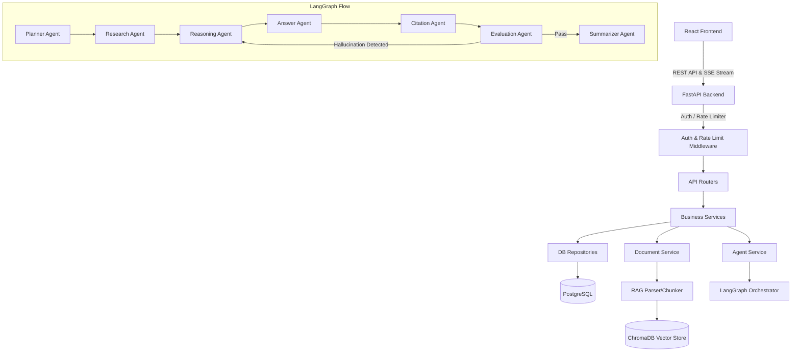
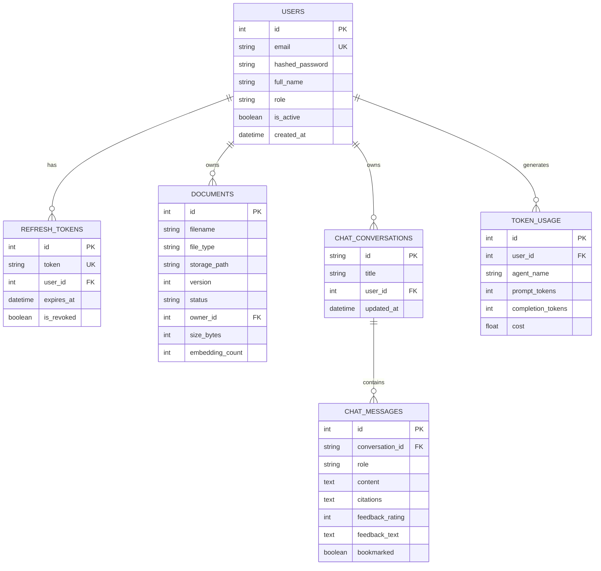

# AI-Enterprise Multi-Agent Knowledge Assistant

<p align="left">
  <a href="https://frontend-beige.vercel.app"></a>
  <a href="https://render.com"></a>
  <a href="https://github.com/HarshithanagashreeR/AI-Workspace-Enterprise-Multi-Agent-Knowledge-Assistant"></a>
  <a href="https://frontend-beige.vercel.app"></a>
</p>

A production-grade, highly scalable, Multi-Agent Enterprise Knowledge Intelligence Platform. This workspace combines a modern **React + TypeScript** frontend, a high-performance **FastAPI** backend, **PostgreSQL** for structured storage, and **ChromaDB** for vector embeddings. The Retrieval-Augmented Generation (RAG) pipeline is fully orchestrated using a 7-agent network coordinated through **LangGraph** and **LangChain**.

---

## Technical Architecture



### Multi-Agent Network (LangGraph)
The platform uses seven specialized agents working together:
1. **Planner Agent**: Analyzes the question and defines step-by-step query splits and reasoning tasks.
2. **Research Agent**: Uses semantic and keyword queries on ChromaDB to retrieve facts.
3. **Reasoning Agent**: Synthesizes the facts, analyzing context validity and consistency.
4. **Answer Agent**: Formulates a detailed, Markdown-formatted answer based on synthesized reasoning.
5. **Citation Agent**: Maps statements in the answer back to exact document chunks.
6. **Evaluation Agent**: Checks for hallucinations by comparing the answer to retrieved context. Repairs answer through a Reasoning feedback loop.
7. **Summarizer Agent**: Generates a concise title summarizing the conversation.

---

## Features

- **Multi-Agent RAG Orchestration**: Powered by LangGraph to plan, research, reason, cite, and evaluate responses.
- **Strict Hallucination Detection**: Closed-loop evaluation agent that re-routes responses for corrections if hallucinations are detected.
- **Enterprise-Grade Authentication**: Secure JWT-based access and refresh token authentication flows.
- **Real-time SSE Streaming**: High-throughput Server-Sent Events (SSE) stream backend logs, agent steps, and final answers.
- **Robust Document Management**: Secure upload and automated parsing/indexing of PDF, DOCX, CSV, TXT, and MD files.
- **Interactive Dashboards**: Real-time performance analytics, token usage tracking, and administrative logs.
- **Modern UI/UX**: Designed using React, TypeScript, TailwindCSS, featuring glassmorphism, responsive sidebar navigation, and command palette.

---

## Tech Stack

### Backend
- **Framework**: FastAPI (Python 3.12)
- **Agent Framework**: LangGraph, LangChain
- **Database**: PostgreSQL (SQLAlchemy ORM, Pg8000 driver)
- **Vector DB**: ChromaDB
- **Authentication**: JWT (JSON Web Tokens)
- **Testing**: Pytest

### Frontend
- **Framework**: React 18 (TypeScript)
- **Build Tool**: Vite
- **Styling**: TailwindCSS
- **State Management**: Zustand
- **Routing**: Client-side routing with Vercel configuration

### DevOps & Deployment
- **Containerization**: Docker, Docker Compose
- **Web Server / Reverse Proxy**: Nginx (Frontend container)
- **PaaS Targets**: Render, Vercel (Frontend routing configurations)

---

## Folder Structure

```
├── .devcontainer/         # VS Code container setup configuration
├── backend/                # FastAPI application workspace
│   ├── app/
│   │   ├── agents/         # LangGraph agents (Planner, Research, etc.)
│   │   ├── api/            # Route controllers (Auth, Chat, Admin)
│   │   ├── config/         # System environment configurations
│   │   ├── core/           # Security, Logging, and Middleware
│   │   ├── database/       # DB session and instance initialization
│   │   ├── models/         # SQLAlchemy database models
│   │   ├── rag/            # Vector store clients, BM25, Reranker
│   │   ├── repositories/   # DB query abstraction layer
│   │   ├── schemas/        # Pydantic validation schemas
│   │   └── services/       # Business logic (evaluators, chat services)
│   ├── tests/              # Pytest automated test scripts
│   ├── Dockerfile          # Production backend configuration
│   └── requirements.txt    # Python library requirements
├── frontend/               # React + TypeScript Vite workspace
│   ├── public/             # Static public assets
│   ├── src/
│   │   ├── assets/         # App icons and imagery
│   │   ├── components/     # Reusable React components
│   │   ├── pages/          # App views (AuthPage, Dashboard, etc.)
│   │   ├── services/       # Axios API client setup
│   │   └── store/          # Zustand state slices
│   ├── Dockerfile          # Frontend container Nginx wrapper
│   ├── nginx.conf          # Nginx production configuration
│   └── package.json        # Frontend package manifest
├── docker-compose.yml      # Sandbox / local container orchestration
├── .gitignore              # Global git ignore policy
└── README.md               # Documentation entrypoint
```

---

## Database Schema (PostgreSQL)



---

## Installation Guide

### Prerequisites
- Python 3.12+ (or Node.js 18+ for independent frontend builds)
- Docker & Docker Compose
- OpenAI API Key

### Running Locally with Docker Compose (Recommended)
This starts all components (PostgreSQL database, FastAPI backend, and React frontend) automatically.

1. **Clone the repository and set up environment files:**
   ```bash
   cp .env.example .env
   ```

2. **Populate the environment variables in `.env` (refer to the Environment Variables section below).**

3. **Start the containers:**
   ```bash
   docker compose up --build -d
   ```

4. **Access the application:**
   - **Frontend**: [http://localhost](http://localhost) (via Nginx reverse proxy)
   - **Backend API Docs**: [http://localhost:8000/docs](http://localhost:8000/docs) (Swagger Docs)
   - **PostgreSQL Database**: Port `5432`

---

## Environment Variables

The application is configured using variables declared in the root `.env` or `backend/.env`. Below are the core parameters:

| Variable Name | Description | Default / Example |
|---|---|---|
| `POSTGRES_USER` | PostgreSQL superuser username | `postgres` |
| `POSTGRES_PASSWORD` | Secure password for PostgreSQL | `postgres_secure_password` |
| `POSTGRES_DB` | Application database name | `knowledge_platform` |
| `DATABASE_URL` | SQLAlchemy-compatible DB URI | `postgresql+pg8000://postgres:postgres_secure_password@db:5432/knowledge_platform` |
| `JWT_SECRET_KEY` | Secret key used to sign access tokens | *Secure long random string* |
| `JWT_REFRESH_SECRET_KEY` | Secret key used to sign refresh tokens | *Secure long random string* |
| `ACCESS_TOKEN_EXPIRE_MINUTES` | Lifetime of an access token | `30` |
| `OPENAI_API_KEY` | Required API key for OpenAI LLM services | `sk-proj-...` |
| `CHROMA_PERSIST_DIRECTORY` | Disk directory for vector storage database | `./chromadb_store` |
| `RATE_LIMIT_PER_MINUTE` | Maximum API requests per client IP per minute | `100` |
| `FRONTEND_URL` | Allowed origin for CORS configurations | `http://localhost:5173` |
| `ENVIRONMENT` | Target environment mode | `development` / `production` |

---

## API Documentation

### Authentication (`/api/v1/auth`)
* `POST /register`: Registers a new user account.
  * Request: `{ "email": "user@org.com", "password": "securepassword", "full_name": "John Doe" }`
* `POST /login`: Validates password and issues access/refresh tokens.
  * Request: `{ "email": "user@org.com", "password": "securepassword" }`
  * Response: `{ "access_token": "...", "refresh_token": "...", "user": { "role": "admin" } }`
* `POST /refresh`: Silently refreshes access tokens.
  * Request: `{ "refresh_token": "..." }`

### Document Library (`/api/v1/documents`)
* `POST /upload`: Uploads a file (PDF, DOCX, CSV, TXT, MD) and starts indexing.
  * Content-Type: `multipart/form-data`
* `GET /`: Lists all documents owned by the current user.
  * Response: List of document metadata objects.
* `DELETE /{doc_id}`: Deletes a document and its corresponding vector embeddings in ChromaDB.

### Chat & Queries (`/api/v1/chat`)
* `POST /conversations`: Initiates a new chat workspace conversation.
* `GET /conversations`: Retrieves all active user conversation logs.
* `POST /conversations/{conversation_id}/query`: SSE streaming endpoint. Streams real-time agent execution logs and final markdown answer with source citations.
  * Request: `{ "content": "What is the Q3 revenue target?" }`
  * Stream Format: `data: {"type": "agent", "agent": "planner", "message": "..."}` $\rightarrow$ `data: {"type": "final", "content": "...", "citations": [...]}`
* `POST /messages/{message_id}/feedback`: Upvotes/downvotes message content.
* `POST /messages/{message_id}/bookmark`: Saves message references.

### Admin Dashboard (`/api/v1/admin`)
* `GET /stats`: Returns system telemetry, including total users, documents, vectors count, cost statistics, and token summaries.
* `GET /logs`: Returns core system audit logs.

---

## Screenshots

*A view of the Premium Executive Dashboard and Chat interfaces will appear here once generated.*
*(Screenshots section can be populated with deployment visual attachments.)*

---

## Future Enhancements

1. **Hybrid Retrieval**: Combine sparse (BM25) and dense (semantic embeddings) search with Cross-Encoder re-ranking.
2. **Local Model Support**: Integrate Ollama or vLLM to allow fully offline setups (e.g. running Llama-3 or Mistral).
3. **Advanced Access Control**: Row-level security for workspaces and document catalogs using granular role permissions.
4. **Agent Debugger UI**: Interactive node visualizer highlighting actual routing pathways inside LangGraph.

---

## License

Distributed under the MIT License. See [LICENSE](LICENSE) for more details.
